# Expense Track

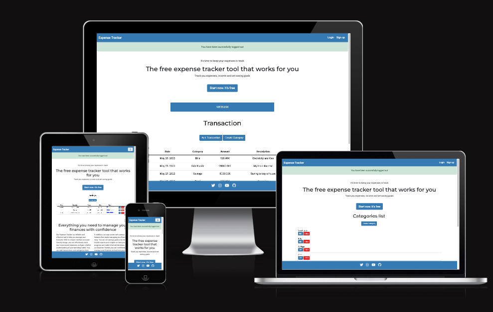

Expense Track is a personal finance website that allows users to track their expenses, income, and
savings goals. The website allows users to create transactions and assign them to specific categories, 
and then caloculates and display the user's current balance.
Users can also set savings goals and track their progress towards achieving them.

[Visit live website](https://expensetrack.herokuapp.com/)

---

## Content

- [Expense Track](#expense-track)
  - [Content](#content)
  - [User Experience](#user-experience)
  - [Features](#features)
    - [Existing Features](#existing-features)
    - [Future Implementations](#future-implementations)
  - [Deployment and Local Development](#deployment-and-local-development)
    - [Deployment](#deployment)
    - [Local Development](#local-development)
  - [Technologies Used](#technologies-used)
  - [Testing](#testing)
  - [Credits](#credits)
    - [Code Used](#code-used)
    - [Content](#content-1)
    - [Media](#media)
  - [Acknowledgments](#acknowledgments)

---

## User Experience

### User Stories

#### New Users 

* As a new user I want to be able to create an account so that I can start tracking my expenses and income
* As a user I want to receive confirmation feedback after registering on the application so that I can be sure that my registration was successful

#### Returning Users 

* As a registered user I want to be able to log in to the application so that I can access my account and view my financial data.
* As a user I want to receive confirmation feedback after submitting the login form so that I know that I am successfully logged In.
* As a user I want to see my current balance so that I can quickly check my financial situation.
* As a user I want the website to be responsive so that I can easily access and use it on any device.
* As a user I want a clear and easy-to-use navigation bar so that easily access different pages and features.
* As a user I want to be able to log out of the application so that so that no one else can access my account.
* As a user I want to be able to create categories so that I categorize my income, expense or saving goals.
* As a user I want to be able to add a new income so that I can keep track of my earnings.
* As a user I want to be able to add a new expense so that I can keep track of my spending.
* As a user I want to be able to add a savings goal so that I can track my progress toward achieving it.
* As a user I want to be able to edit an expense, income, category or saving goal item so that so that I can correct a mistake.
* As a user I want to be able to delete an income, expense, category or savin goal item so that I can remove it from my records and keep my financial data accurate.
* As a user I want to be able to navigate through the transaction data so that I can easily find and access the information I need.
* As a user I want to be able to view a dashboard that displays my current financial status so that so that I can easily track my progress.

### Colour Scheme 

For this website, I intentionally adopted a minimalist design approach with a limited color palette.
In the future, I plan to improve the design by adding the following color scheme to create a more visually 
appealing and a better user experience.

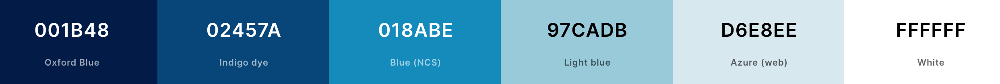

### Typography

I used Google Fonts for the following fonts:

* Montserrat - for headings
* Roboto - for paragraphs

### Imagery 

On the landing page, I used screenshots of the projects as images to provide users with a preview of 
what they can expect once they register on the website. These images are intended to give users an idea 
of the features and functionalities that they can find upon signing up.

### Database Schema 

The database consists of three models: Category, Savings and Transactions. 

* Category: Represents the different categories that can be assigned to transactions. 
Each category is associated with a user and has a name.

* Savings: Represents savings goals created by users. It includes fields such as name, description,
target amount, target date, and progress.

* Transaction: Represents financial transactions. It includes fields for the user, category, amount, description,
date, transaction type (income, expense or saving goal), and a reference to the associated savings goal if applicable.

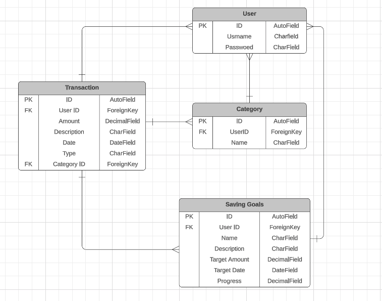

### Wireframes

Wireframes were created using [Balsamiq](https://balsamiq.com/).

The initial wireframes provided a basic layout, but as development progressed, changes were made, new pages were added, 
and some features were removed and postponed for future implementation.

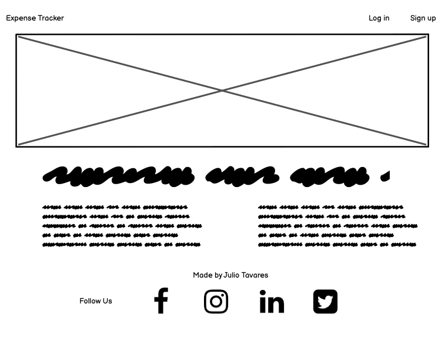
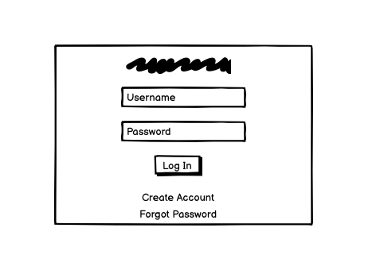
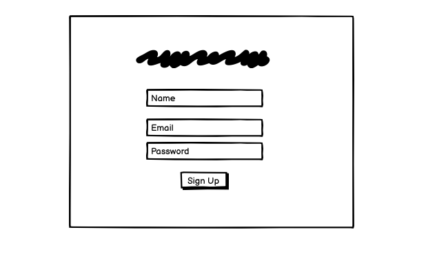

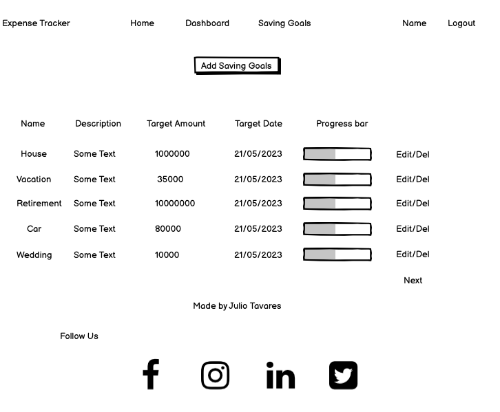
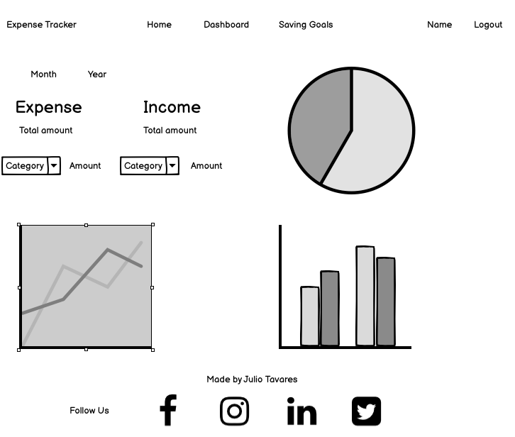

## Agile Development 

This project was developed using agile development principles. 

I used [GitHub Project](https://github.com/users/jmanager25/projects/1/views/1) as an agile tool to manage the project's
progress using agile principles. With GitHub Issues, I created epics and user stories and each user stories included acceptance criterias, 
to determine when that user story was completed successfully. I also defined tasks within the user stories, defining specific actions i needed
to take to fulfill the acceptance criteria.

To prioritize the work effectively, I used MOSCOW prioritization. These allowed me to categorize issues into four main groups: 
"must have" features that were critical for the project, "could have" features that were desirable but not essential, 
"should have" features that had moderate importance, and "won't have" features that were intentionally excluded.

To maintain a clear project structure, I linked related issues to their corresponding epics. This provided a high-level view of the project's progress and helped me stay organized throughout the development process.

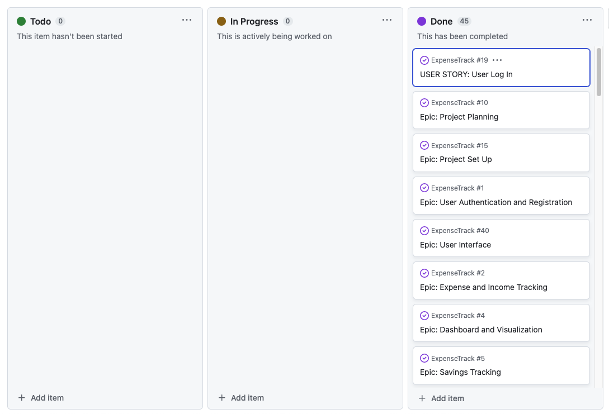
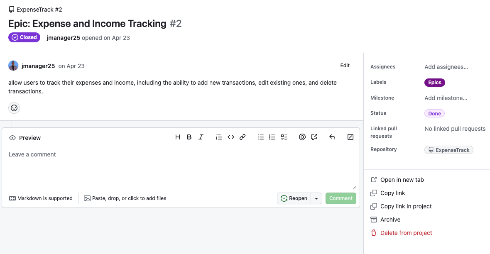
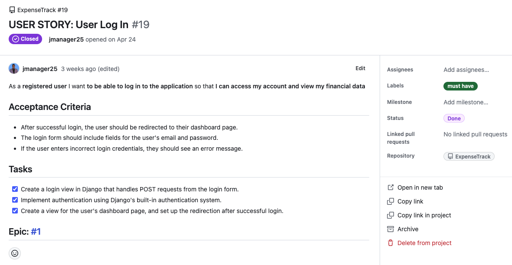

## Features

### Existing Features

#### Landing Page 

The landing page is the first page users see when they visit the website. It has a picture slideshow with four images, showing what the website looks like. There is also text that explains what the website is all about. It helps users understand what they can do on the website and why it's useful. The goal is to make users interested and want to explore more.

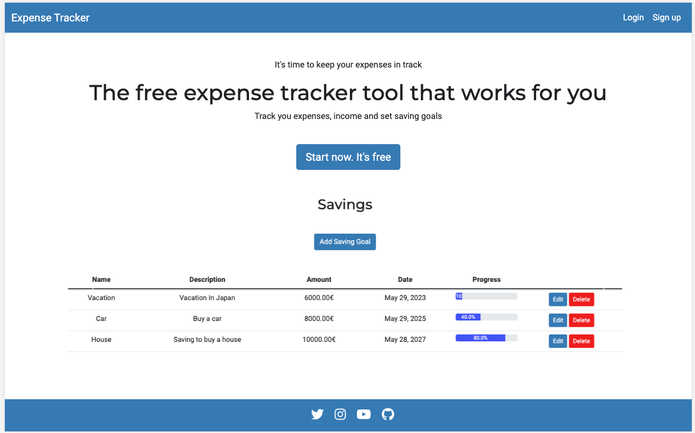

#### Sign Up 

The sign-up page enables users to register by providing the username, email address, and password.

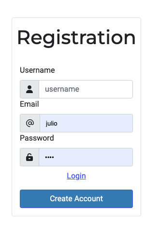

#### Login 

The login page enables users to access their accounts by entering their username and password.

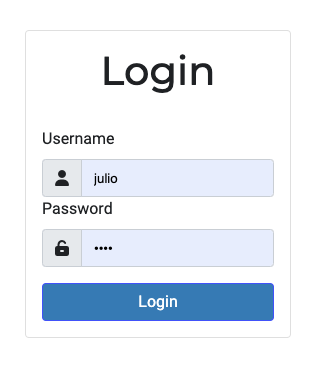

#### Navigation Bar 

The navigation bar is located at the top of the page and adapts based on the user's login status.
When a user is logged in, the navigation bar displays the site's name along with links to important pages 
such as the transaction page, dashboard page, savings page, and categories page. It also shows the username of 
the logged-in user. Additionally, a logout button is provided to allow users to securely log out of their accounts.

On the other hand, if a user is not logged in, the navigation bar still shows the site's name but only includes buttons 
for logging in and signing up.

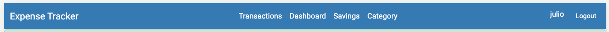

#### Footer

The footer section of the website displays social links.

#### Transaction Page

Once users log in, the transaction page serves as their "home" page. Here, they can view important details such as their balance and the existing transactions. Additionally, the page includes buttons that allow users to add new transactions and categories.

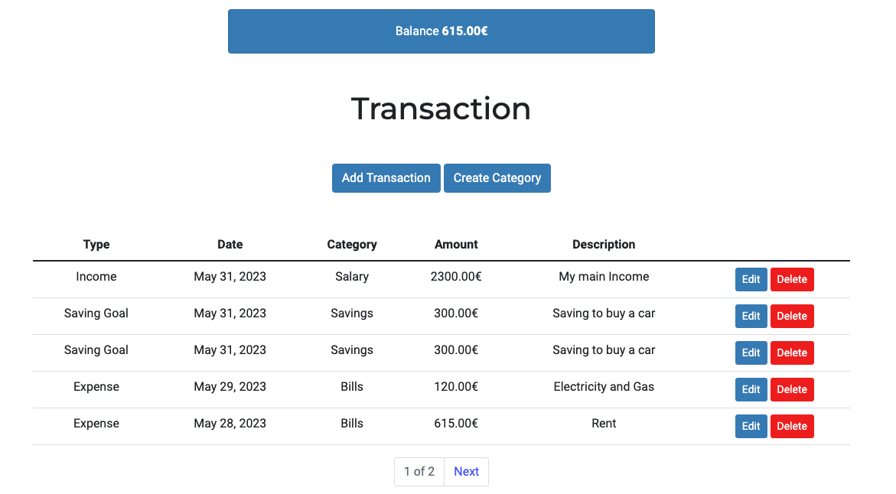

#### Add Transaction

The add transaction page allows users to enter new transactions with the following details: transaction type (income, expense, or saving goals), date, category, amount, description, and an optional selection for a saving goal if the transaction type is saving goals.

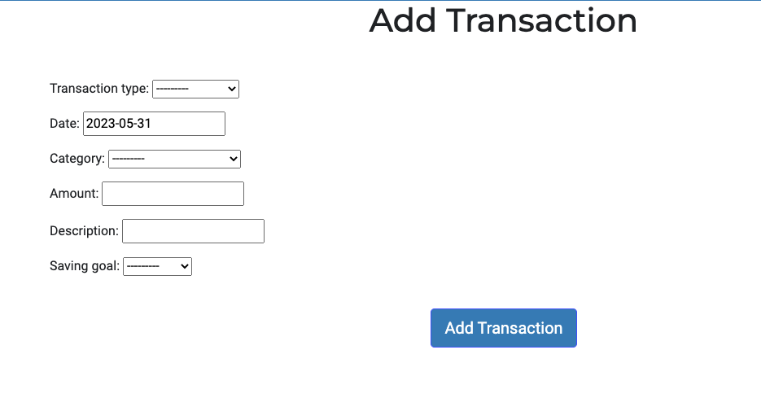

#### Edit Transaction

The edit transaction page enables users to modify existing transactions.

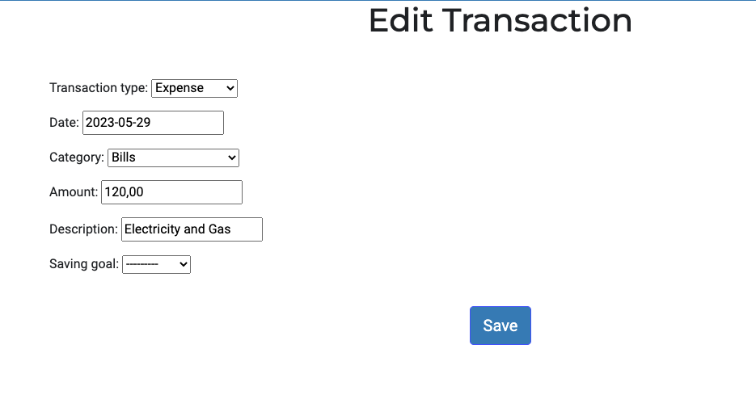

#### Dashboard Page

The dashboard shows users a summary of their finances. They can view their total expenses, income, and savings, as well as a list of categories with the respective amounts. There's also a filter option to display amount for a specific category.

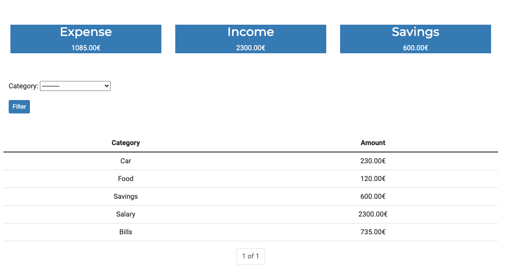

#### Savings Page

The savings page showcases the saving goals created by the user. On this page, users can view important details such as the name, description, target amount, target date, and progress of their savings goals.

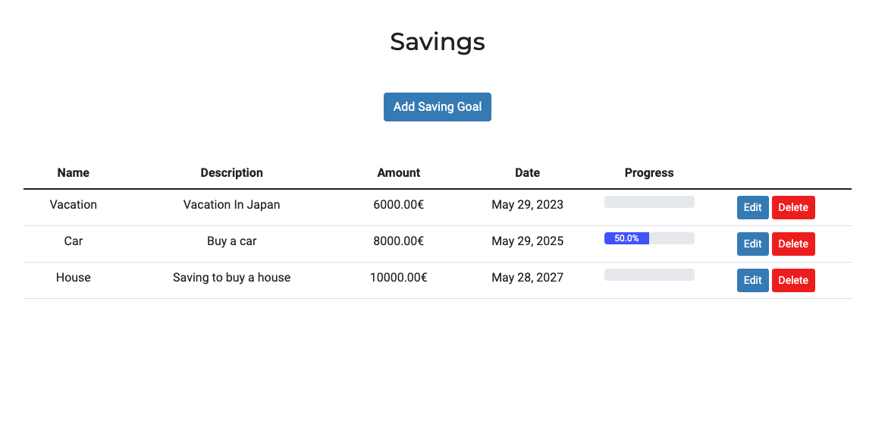

#### Add Savings

The add savings page enables users to create new saving goals.

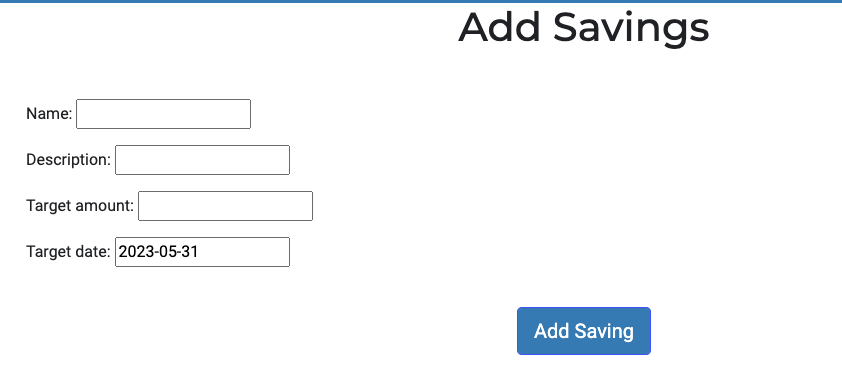

#### Edit Savings

The edit savings page enables users to update existing saving goals.

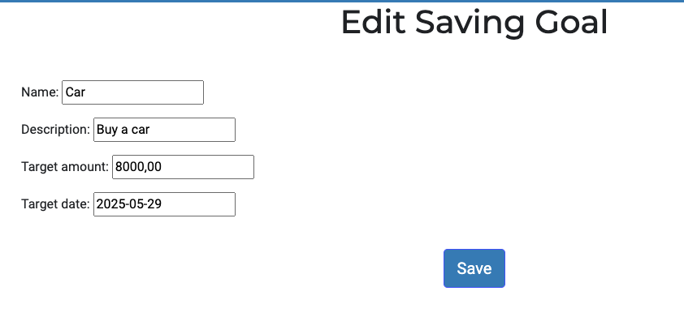

#### Categories Page

The categories page presents users with a list of categories they have created, there is also a 
button that allows users to add new categories.

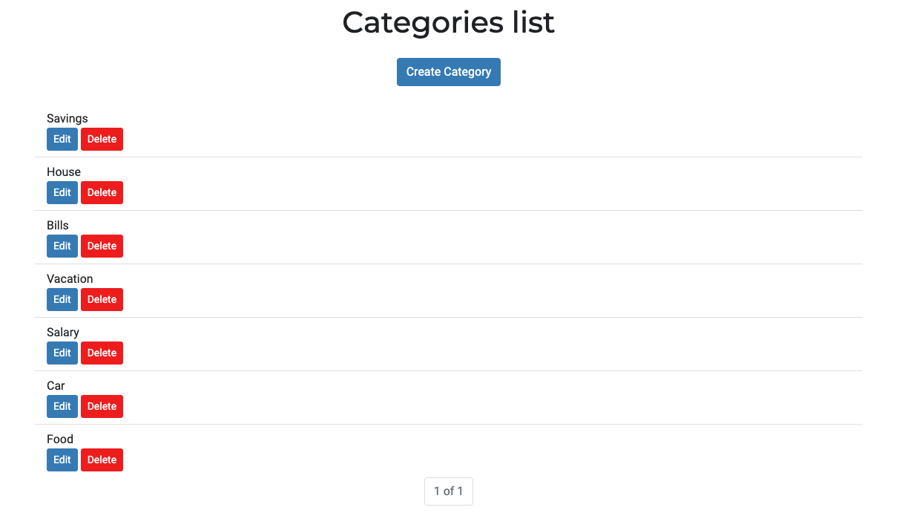

#### Add Category

The add category page enables users to create new category.

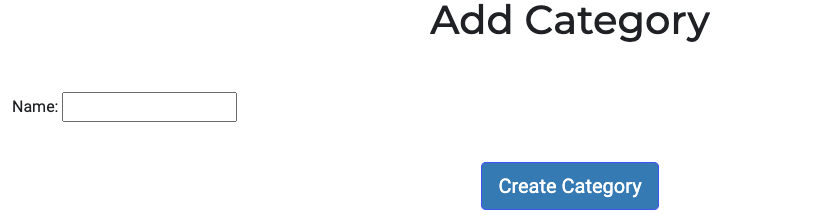

#### Edit Category

The edit category page enables users to update existing category.

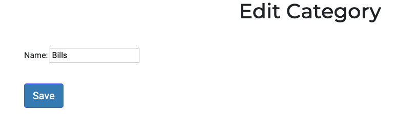

#### Delete Transaction, Category or Saving Goal

When users click the delete button on a transaction, saving goal, or category, a confirmation page is displayed, asking them to confirm their decision to delete the respective item. The page presents the name of the item to be deleted and provides two options:

* "Yes, I am sure": If users click "Yes" the item will be permanently deleted from the database.
* "Cancel": If users click "Cancel," they will be redirected back to the respective page without deleting the item.

This confirmation step adds an extra layer of caution to ensure that users do not accidentally delete important data.

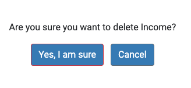

#### Confirmation Messages

Confirmation messages are displayed to users for various actions to provide feedback and ensure a seamless user experience. Users will see confirmation messages in the following scenarios:

* Successful Login: After successfully logging in, users will receive a confirmation message indicating their successful login.
* Logout: When users successfully log out, a confirmation message will be displayed, confirming that they have been securely logged out of their account.
* Create Item: After creating a new item (such as a transaction, saving goal, or category), users will receive a confirmation message confirming the successful creation of the item.
* Edit Item: Upon successfully editing an item, users will be presented with a confirmation message indicating that the changes have been saved and applied to the item.
* Delete Item: When an item is successfully deleted (such as a transaction, saving goal, or category), users will see a confirmation message confirming the deletion.

These confirmation messages provide users with clear feedback and assurance that their actions have been executed successfully.

### Future Implementations

In future inplementations I would like to:

* Password Reset: Implement a feature that allows users to reset their password if they forget it.
* Social Account Login: Provide users with the option to log in using their social media accounts.
* Color Palette: Incorporate the specified color palette into the website design, creating a visually appealing user interface.
* Financial Data Filtering: Enable users to filter their financial data by date, specifically by year and month, on the dashboard.
* Visual Graphics: Implement visually appealing graphics and charts to present users with a visual representation of their financial situation.
* Styling Add and Edit Forms: Style the add and edit forms for transactions, savings goals, and categories, making them visually appealing and user-friendly.

## Deployment and Local Development

### Deployment

### Local Development

## Technologies Used

* HTML
* CSS
* Python
* Django
* Bootstrap
* Git
* GitHub
* Heroku
* Gitpod
* Claudinary
* Am I Responsive
* ElephantSQL
* PostgreSQL
* LucidChart Diagram

## Testing

[TESTING.md](TESTING.md)

## Credits

### Code Used

* 
* 
* 
* 
* 
* 
* 
* 
* 

### Content

* 

## Acknowledgments

I would like to thank the following people:

* My girlfriend for her patience and support while I was working on the project
* My mentor, Mitko, for his guidance throughout the project
* My collegues from code institute for the support and motivation on Slack