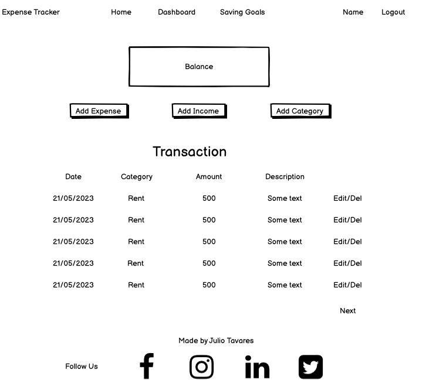

# Expense Track

Expense Track is a personal finance website that allows users to track their expenses, income, and
savings goals. The website allows users to create transactions and assign them to specific categories, 
and then caloculates and display the user's current balance.
Users can also set savings goals and track their progress towards achieving them.

[Visit live website](https://expensetrack.herokuapp.com/)

---

## Content

- [Expense Track](#expense-track)
  - [Content](#content)
  - [User Experience](#user-experience)
  - [Features](#features)
    - [Existing Features](#existing-features)
    - [Future Implementations](#future-implementations)
  - [Deployment and Local Development](#deployment-and-local-development)
    - [Deployment](#deployment)
    - [Local Development](#local-development)
  - [Technologies Used](#technologies-used)
  - [Testing](#testing)
  - [Credits](#credits)
    - [Code Used](#code-used)
    - [Content](#content-1)
    - [Media](#media)
  - [Acknowledgments](#acknowledgments)

---

## User Experience

### User Stories

#### New Users 

* As a new user I want to be able to create an account so that I can start tracking my expenses and income
* As a user I want to receive confirmation feedback after registering on the application so that I can be sure that my registration was successful

#### Returning Users 

* As a registered user I want to be able to log in to the application so that I can access my account and view my financial data.
* As a user I want to receive confirmation feedback after submitting the login form so that I know that I am successfully logged In.
* As a user I want to see my current balance so that I can quickly check my financial situation.
* As a user I want the website to be responsive so that I can easily access and use it on any device.
* As a user I want a clear and easy-to-use navigation bar so that easily access different pages and features.
* As a user I want to be able to log out of the application so that so that no one else can access my account.
* As a user I want to be able to create categories so that I categorize my income, expense or saving goals.
* As a user I want to be able to add a new income so that I can keep track of my earnings.
* As a user I want to be able to add a new expense so that I can keep track of my spending.
* As a user I want to be able to add a savings goal so that I can track my progress toward achieving it.
* As a user I want to be able to edit an expense, income, category or saving goal item so that so that I can correct a mistake.
* As a user I want to be able to delete an income, expense, category or savin goal item so that I can remove it from my records and keep my financial data accurate.
* As a user I want to be able to navigate through the transaction data so that I can easily find and access the information I need.
* As a user I want to be able to view a dashboard that displays my current financial status so that so that I can easily track my progress.

### Colour Scheme 

For this website, I intentionally adopted a minimalist design approach with a limited color palette.
In the future, I plan to improve the design by adding the following color scheme to create a more visually 
appealing and a better user experience.

### Typography

I used Google Fonts for the following fonts:

* Montserrat - for headings
* Roboto - for paragraphs

### Imagery 

On the landing page, I used screenshots of the projects as images to provide users with a preview of 
what they can expect once they register on the website. These images are intended to give users an idea 
of the features and functionalities that they can find upon signing up.

### Database Schema 

The database consists of three models: Category, Savings and Transactions. 

* Category: Represents the different categories that can be assigned to transactions. 
Each category is associated with a user and has a name.

* Savings: Represents savings goals created by users. It includes fields such as name, description,
target amount, target date, and progress.

* Transaction: Represents financial transactions. It includes fields for the user, category, amount, description,
date, transaction type (income, expense or saving goal), and a reference to the associated savings goal if applicable.

### Wireframes

Wireframes were created using [Balsamiq](https://balsamiq.com/).

The initial wireframes provided a basic layout, but as development progressed, changes were made, new pages were added, 
and some features were removed and postponed for future implementation.

## Agile Development 

This project was developed using agile development principles. 

I used [GitHub Project](https://github.com/users/jmanager25/projects/1/views/1) as an agile tool to manage the project's
progress using agile principles. With GitHub Issues, I created epics and user stories and each user stories included acceptance criterias, 
to determine when that user story was completed successfully. I also defined tasks within the user stories, defining specific actions i needed
to take to fulfill the acceptance criteria.

To prioritize the work effectively, I used MOSCOW prioritization. These allowed me to categorize issues into four main groups: 
"must have" features that were critical for the project, "could have" features that were desirable but not essential, 
"should have" features that had moderate importance, and "won't have" features that were intentionally excluded.

To maintain a clear project structure, I linked related issues to their corresponding epics. This provided a high-level view of the project's progress and helped me stay organized throughout the development process.

## Features

### Existing Features

### Future Implementations

## Deployment and Local Development

### Deployment

### Local Development

## Technologies Used

## Testing

[TESTING.md](TESTING.md)

## Credits

### Code Used

### Content

### Media

## Acknowledgments
