# Expense Track - Testing

## Validation Testing 

### HTML 

[W3C](https://validator.w3.org/) was used to validate the html on all pages of the website. All passed 
without issues. 

| Page | Result |
| :--- | :--- | 
| Landing Page | Pass | 
| Login Page | Pass | 
| Sign Up Page | Pass | 
| Transaction Page | Pass | 
| Add Transaction Page | Pass | 
| Edit Transaction Page| Pass | 
| Delete Transaction Page | Pass | 
| Dashboard Page | Pass | 
| Savings Page | Pass |
| Add Savings Page | Pass |
| Edit Savings Page | Pass |
| Delete Savings Page | Pass |
| Categories Page | Pass |
| Add Categories Page | Pass |
| Edit Categories Page | Pass |
| Delete Categories Page | Pass |

### CSS 

[W3C](https://jigsaw.w3.org/css-validator/) was used to validade the CSS and passed without any issue.

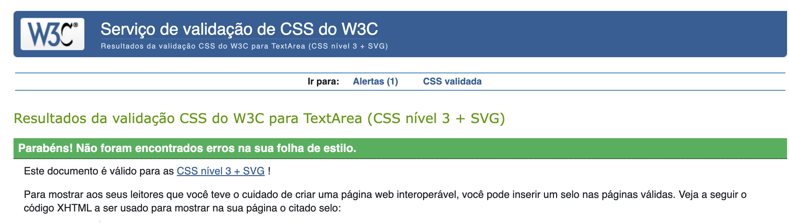

### Python 

For the python code, [Code Institute Python Linter](https://jigsaw.w3.org/css-validator/) was use. 

| File | Result | Evidence |
| :--- | :--- | :---: |
| **Category** |
| Urls | Pass | [Urls validation](documentation/testing/validators/category-url.png) |
| Views | Pass | [Views validation](documentation/testing/validators/category-views.png) |
| **Category** |
| Urls | Pass | [Urls validation](documentation/testing/validators/dashboard-url.png) |
| Views | Pass | [Views validation](documentation/testing/validators/dasboard-view.png) |
| **Expensetrack** |
| Urls | Pass | [Urls validation](documentation/testing/validators/expensetrack-url.png) |
| Settings | Pass | [Settings validation](documentation/testing/validators/settings.png) |
| **Expensetracker** |
| Get Transactions | Pass | [Get Transactions validation](documentation/testing/validators/get-transactions.png) |
| Models | Pass | [ Models validation](documentation/testing/validators/models.png) |
| Urls | Pass | [Urls validation](documentation/testing/validators/expensetracker-urls.png) |
| Views | Pass | [Views validation](documentation/testing/validators/expensetracker-views.png) |
| **Savings** |
| Urls | Pass | [Urls validation](documentation/testing/validators/savings-url.png) |
| Views | Pass | [Views validation](documentation/testing/validators/savings-view.png) |

### Lighthouse

#### Home Page 

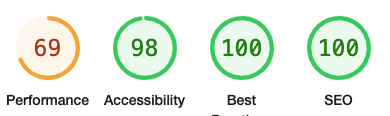

#### Transaction Page 

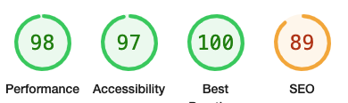

#### Categories Page 

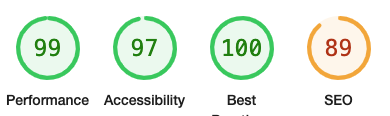

#### Dashboard Page

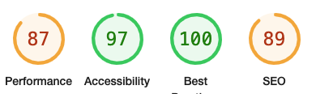

## Manual Testing 

### Responsiveness

I have extensively tested the responsiveness of my website using developer tools on a wide range of devices, including small screens like smartphones and large screens like desktop monitors. The website is fully responsive on all devices present on google dev tools.
The screenshots below demonstrate how the website looks on various devices:

#### Mobile Screens

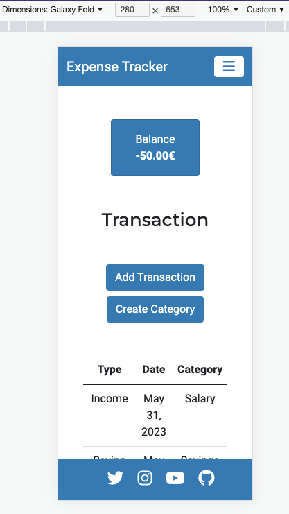
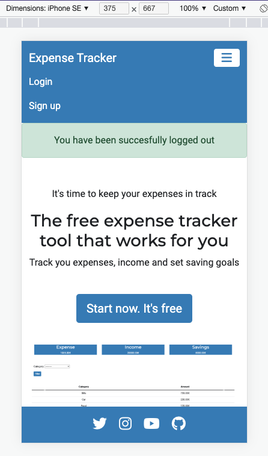

#### Tablet Screens

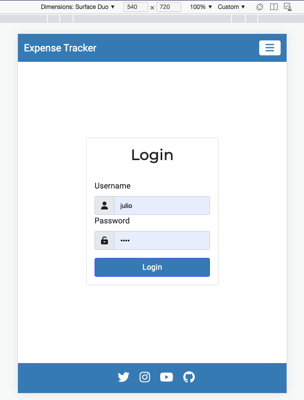

#### Laptop Screens

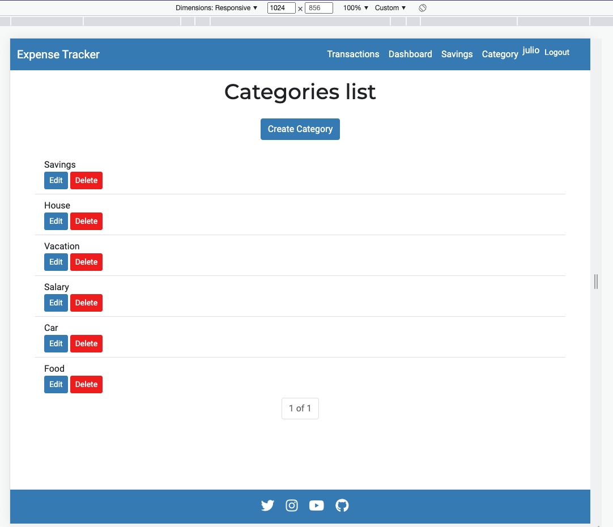

#### Desktop Screens

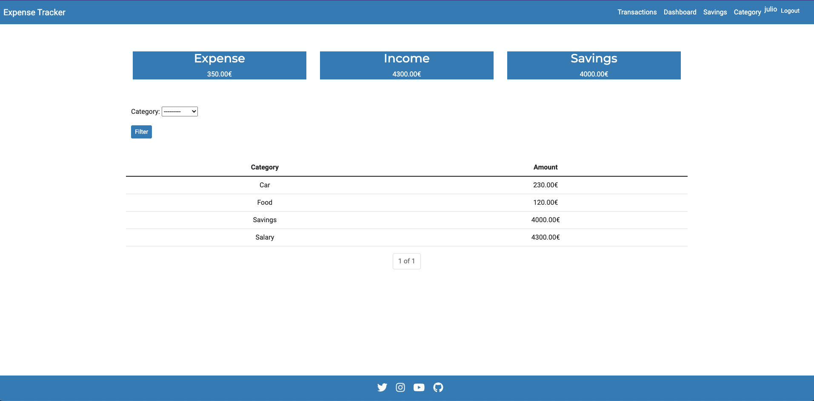

## Bugs 

### Fixed Bugs

During the development of this project I encountered several bugs, below are the main ones:

Error when i tried to access the for add_transaction:

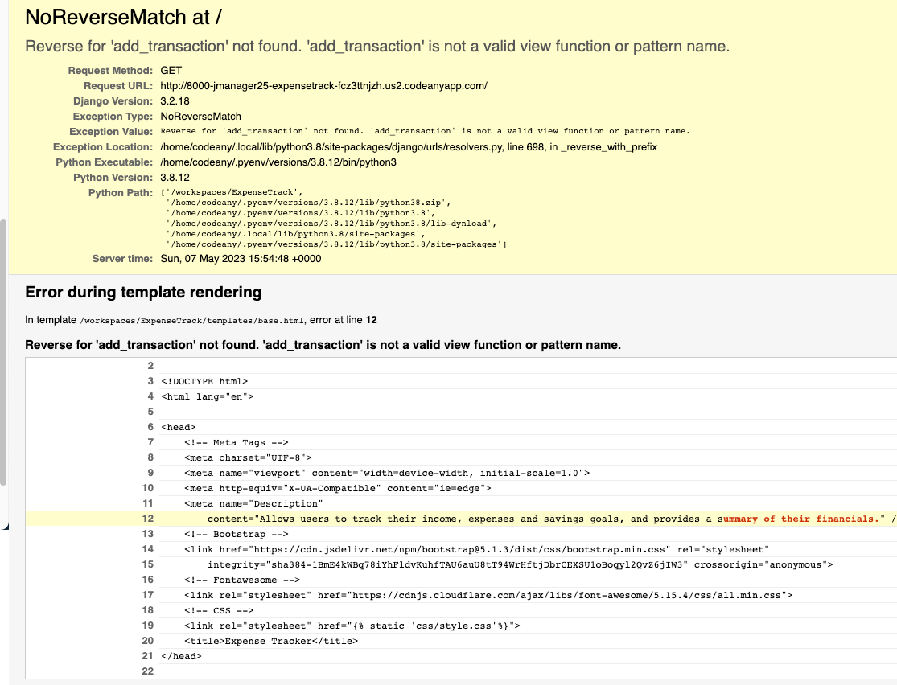

* Solution: I didn't import the urls in the main expensetrack urls file, once i fixed that it worked.

When clicking the logout button i got this error:

* Solution: In the views.py file, I had accidentally created a recursive call to the log_out(request) 
function instead of calling the logout method provided by Django's authentication system. This recursive call 
caused the function to run indefinitely, leading to the "maximum recursion depth exceeded" error. Once I changed 
the function to call the correct logout method, the error disappeared.

 When submitting the for i got the following error:

 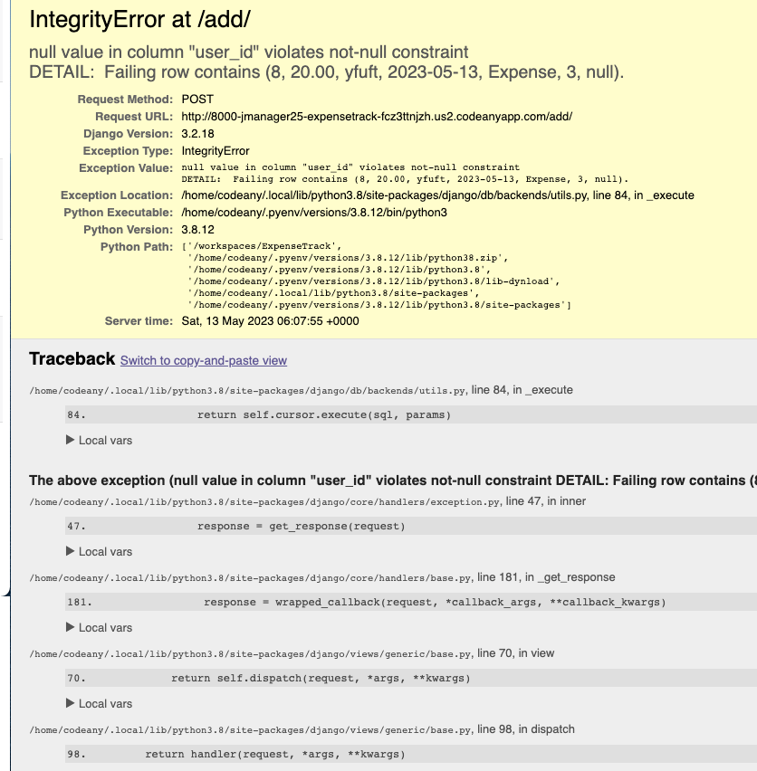

 Every user could see the transactions from all the other users:

 * Solution: This happened because I defined transaction as transaction.object.all() instead of filtering 
 it by the user that was logged in as such, transactions = Transaction.object.filter(user=request.user).

 When i login the transactions dont appear in the home view. they only appear after i reload the page or add a new transaction. 

 * Solution: In the login view i was using return render(request, ’home.html’), i changed that to return redirect(’home’) and it worked.

 ### Existing Bugs 

 * On the Navbar the username does not align properly with the rest of nav items.
 * The buttons on the website are currently not styled properly, and the hover effect applied to them is not as intended. It does not match the desired design and user experience.
